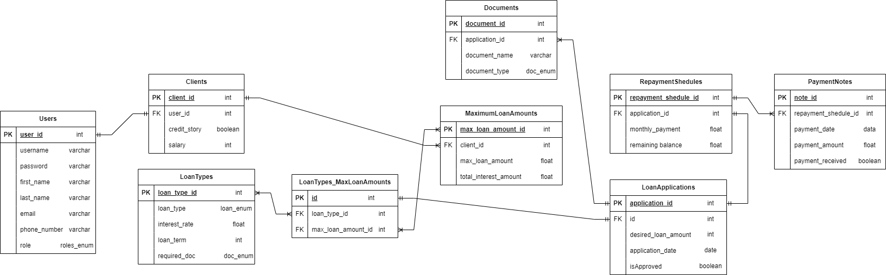

# Data Modeling

### Content

- [Technology](#technology)
- [Entity Relationship Diagram](#entity-relationship-diagram)
- [Tables](#tables)
  - [Users](#1-users)
  - [Clients](#2-clients)
  - [Workers](#3-workers)
  - [Admin](#4-admin)
  - [Documents](#5-documents)
  - [LoanApplications](#6-loanapplications)
  - [LoanTypes_LoanApplications](#7-loantypes_loanapplications)
  - [LoanTypes](#8-loantypes)
  - [RepaymentSchedules](#9-repaymentschedules)
  - [PaymentNotes](#10-paymentnotes)
  - [MaximumLoanAmounts](#11-maximumloanamounts)
- [Enumeration](#enumeration)
  - [User roles](#1-user-roles)
  - [Document types](#2-document-types)
  - [Loan types](#3-loan-types)
- [Relationships](#relationships)

## Technology

- Database - PostgreSQL

## Entity Relationship Diagram

## Tables

### 1. Users

Table for authentication and storing basic user info.

| Key | Column Name  | Data Type  | Description                     |
| --- | ------------ | ---------- | ------------------------------- |
| PK  | user_id      | int        | Primary key for the users table |
|     | username     | varchar    | User's login                    |
|     | password     | varchar    | User's password                 |
|     | email        | varchar    | User's email                    |
|     | phone_number | varchar    | User's phone number             |
|     | role         | roles_enum | Role of the user.               |

### 2. Clients

Information about clients.

| Key | Column Name | Data Type | Description                       |
| --- | ----------- | --------- | --------------------------------- |
| PK  | client_id   | int       | Primary key for the clients table |
| FK  | user_id     | int       | Foreign key from the users table  |
|     | name        | varchar   | Client's name                     |
|     | salary      | int       | Client's salary                   |

### 3. Workers

Information about workers.

| Key | Column Name | Data Type | Description                       |
| --- | ----------- | --------- | --------------------------------- |
| PK  | worker_id   | int       | Primary key for the workers table |
| FK  | user_id     | int       | Foreign key from the users table  |
|     | name        | varchar   | Worker's name                     |

### 4. Admin

Information about admins.

| Key | Column Name | Data Type | Description                      |
| --- | ----------- | --------- | -------------------------------- |
| PK  | admin_id    | int       | Primary key for the admin table  |
| FK  | user_id     | int       | Foreign key from the users table |
|     | name        | varchar   | Admin's name                     |

### 5. Documents

Details of documents associated with clients.

| Key | Column Name    | Data Type | Description                                 |
| --- | -------------- | --------- | ------------------------------------------- |
| PK  | document_id    | int       | Primary key for the documents table         |
| FK  | application_id | int       | Foreign key from the loan application table |
|     | document_name  | varchar   | Name of the document                        |
|     | document_type  | doc_enam  | Type of the document                        |

### 6. LoanApplications

Loan application details.

| Key | Column Name         | Data Type | Description                            |
| --- | ------------------- | --------- | -------------------------------------- |
| PK  | application_id      | int       | Primary key for the applications table |
| FK  | client_id           | int       | Foreign key from the clients table     |
| FK  | worker_id           | int       | Foreign key from the workers table     |
| FK  | loan_type_id        | int       | Foreign key from the loantypes table   |
|     | desired_loan_amount | int       | Desired loan amount by the client      |

### 7. LoanTypes_LoanApplications

| Key | Column Name    | Data Type | Description                                          |
| --- | -------------- | --------- | ---------------------------------------------------- |
| PK  | id             | int       | Primary key for the loantypes_loanapplications table |
| FK  | loan_type_id   | int       | Foreign key from the loantypes table                 |
| FK  | application_id | int       | Foreign key from the applications table              |

### 8. LoanTypes

Different types of loans available.

| Key | Column Name   | Data Type | Description                                    |
| --- | ------------- | --------- | ---------------------------------------------- |
| PK  | loan_type_id  | int       | Primary key for the loantypes table            |
| FK  | admin_id      | int       | Foreign key from the admin table               |
|     | loan_type     | loan_enum | Type of loan                                   |
|     | interest_rate | float     | Interest rate for the loan type                |
|     | loan_term     | int       | Term/duration of the loan (in months or years) |

### 9. RepaymentSchedules

Schedule of repayments for loans.

| Key | Column Name           | Data Type | Description                                  |
| --- | --------------------- | --------- | -------------------------------------------- |
| PK  | repayment_schedule_id | int       | Primary key for the repaymentschedules table |
| FK  | application_id        | int       | Foreign key from the applications table      |
|     | monthly_payment       | float     | Amount to be paid monthly                    |
|     | remaining_balance     | float     | Remaining balance to be paid                 |

### 10. PaymentNotes

Notes related to payments.

| Key | Column Name           | Data Type | Description                                   |
| --- | --------------------- | --------- | --------------------------------------------- |
| PK  | note_id               | int       | Primary key for the paymentnotes table        |
| FK  | repayment_schedule_id | int       | Foreign key from the repaymentschedules table |
|     | payment_date          | date      | Date of the payment                           |
|     | payment_amount        | float     | Amount paid                                   |

### 11. MaximumLoanAmounts

Maximum loan amounts for applications.

| Key | Column Name           | Data Type | Description                                       |
| --- | --------------------- | --------- | ------------------------------------------------- |
| PK  | max_loan_amount_id    | int       | Primary key for the maximumloanamounts table      |
| FK  | application_id        | int       | Foreign key from the applications table           |
|     | max_loan_amount       | int       | Maximum loan amount available for the application |
|     | total_interest_amount | float     | Total interest amount for the loan                |

## Enumeration

### 1. User roles

| roles_enum |
| ---------- |
| client     |
| worker     |
| admin      |

### 2. Document types

| doc_enum                |
| ----------------------- |
| passport                |
| employment_verification |
| business_plan           |
| purchase_agreement      |

### 3. Loan types

| loan_enum     |
| ------------- |
| personal_loan |
| mortgage      |
| student_loan  |
| business_loan |

## Relationships

The relationships between the tables are:

- Users to Clients: one User can be associated with one Client (one-to-one) through Clients(user_id).
- Users to Workers: one User can be associated with one Worker (one-to-one) through Workers(user_id).
- Users to Admin: one User can be associated with one Admin (one-to-one) through Admin(user_id).
- Clients to Applications: one Client can have multiple Applications (one-to-many) through Applications(client_id).
- Workers to Applications: one Worker can handle multiple Applications (one-to-many) through Applications(worker_id).
- Admin to LoanTypes: one Admin can define multiple LoanTypes (one-to-many) through LoanTypes(admin_id).
- LoanTypes to Applications: one LoanType can be associated with multiple LoanApplications and one LoanApplication can be associated with multiple Loantypes (many-to-many) through LoanTypes_LoanApplications table.
- LoanTypes to Applications: one LoanType can be associated with multiple LoanApplications (one-to-many) through LoanApplications(loan_type_id).
- LoanApplications to RepaymentSchedules: one Application can have one RepaymentSchedule (one-to-one) through RepaymentSchedules(application_id).
- LoanApplications to Documents: one loan application can have multiple Documents (one-to-many) through application_id.
- LoanApplications to MaximumLoanAmounts: one Application can have one MaximumLoanAmount (one-to-one) through MaximumLoanAmounts(application_id).
- RepaymentSchedules to PaymentNotes: one RepaymentSchedule can have multiple PaymentNotes (one-to-many) through PaymentNotes(repayment_schedule_id).
